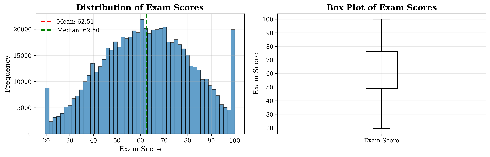
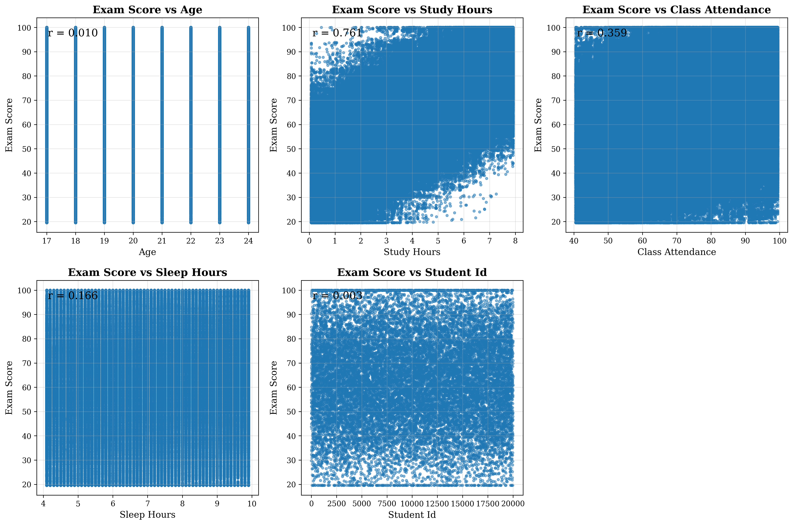
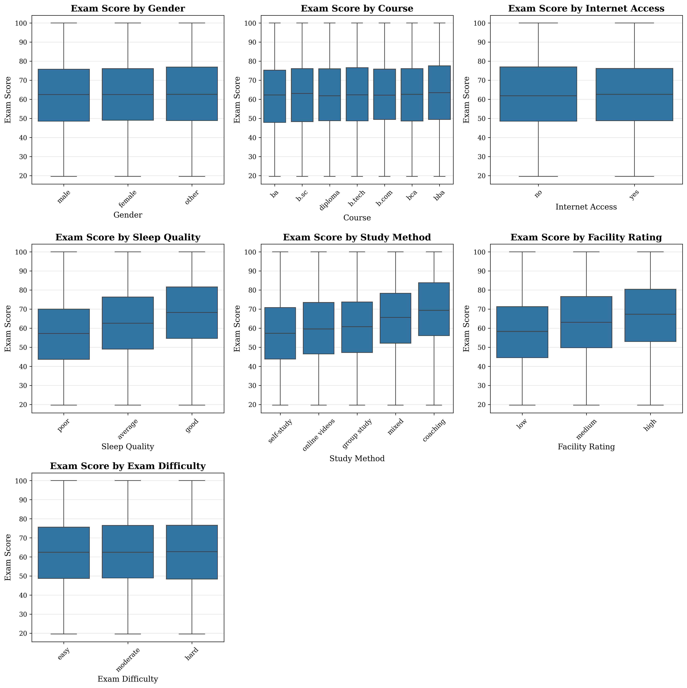
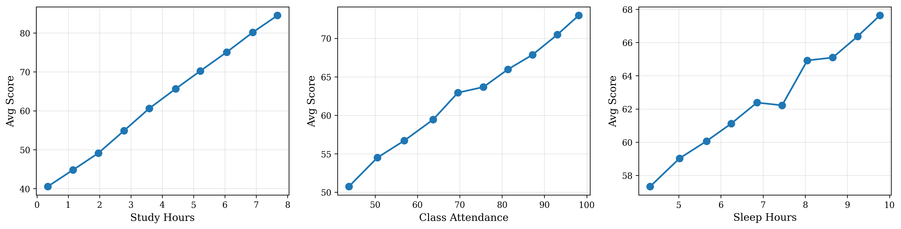
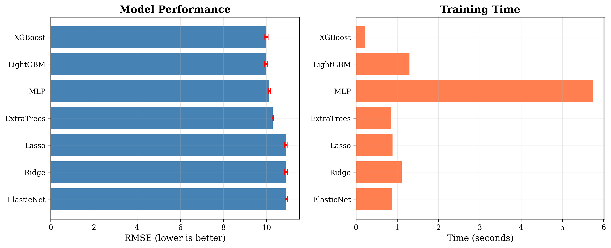

# Kaggle Exam Score Prediction

This report documents my approach to the Kaggle Playground Series S6E1 competition, which involved predicting student exam scores based on study habits, demographics, and environmental factors. 
The final solution achieved a public leaderboard score of **8.678 RMSE**, using a two-stage stacking approach: Ridge regression followed by XGBoost.

## 1. Data Overview

### Dataset Statistics
- **Training samples:** 630,000 (synthetic) + 20,000 (original)
- **Test samples:** 420,000
- **Target variable:** `exam_score` (continuous, range 19.6–100)
- **Target distribution:** Mean = 62.51, Median = 62.60, Std = 18.92



### Features

| Feature | Type | Description |
|---------|------|-------------|
| study_hours | Numeric | Hours spent studying (0–8) |
| class_attendance | Numeric | Attendance percentage (40–100%) |
| sleep_hours | Numeric | Hours of sleep (4–10) |
| age | Numeric | Student age (17–24) |
| gender | Categorical | male/female/other |
| course | Categorical | ba/b.sc/b.com/b.tech/bca/bba/diploma |
| sleep_quality | Categorical | poor/average/good |
| study_method | Categorical | self-study/online videos/group study/mixed/coaching |
| facility_rating | Categorical | low/medium/high |
| exam_difficulty | Categorical | easy/moderate/hard |
| internet_access | Categorical | yes/no |

## 2. Exploratory Data Analysis

### Feature Importance

Correlation analysis revealed a clear hierarchy of predictive power:

| Feature | Correlation with Score |
|---------|----------------------|
| study_hours | **0.761** |
| class_attendance | 0.359 |
| sleep_hours | 0.166 |
| age | 0.010 |
| student_id | 0.003 |

**Key finding:** Study hours is the dominant predictor, explaining ~58% of variance alone.



### Categorical Feature Analysis



**Meaningful categorical effects:**

| Feature | Category Spread (Mean Score) |
|---------|------------------------------|
| Sleep Quality | poor: 57.0 → good: 67.9 (Δ10.9) |
| Study Method | self-study: 57.7 → coaching: 69.2 (Δ11.5) |
| Facility Rating | low: 58.0 → high: 66.7 (Δ8.7) |

**Weak/no signal:**
- Gender: ~0.5 point spread (noise)
- Internet Access: <0.01 point spread (noise)
- Course: ~1.3 point spread (minimal)

### Binned Analysis

Study hours shows consistent linear improvement across bins:

```
STUDY_HOURS:
Bin 0→1: +9.38 points
Bin 1→2: +11.06 points
Bin 2→3: +9.55 points
Bin 3→4: +9.65 points
```

Class attendance and sleep hours show diminishing returns at higher values.



### Transformation Analysis

Testing various transformations against raw features:

```
study_hours:
  original: 0.7609  ← Best
  log:      0.7340
  sqrt:     0.7448
  square:   0.7346

class_attendance:
  original: 0.3593  ← Best (sqrt nearly equal)
  sqrt:     0.3596

sleep_hours:
  original: 0.1664  ← Best
```

**Conclusion:** Raw features work well; transformations don't improve correlation significantly. However, squared and log versions were kept to help tree models find optimal splits.

## 3. Model Selection

### Initial Model Comparison

Quick 3-fold CV on original data only (20k samples):

```
     Model      RMSE      Std     Time
   XGBoost  9.975633 0.093654 0.216s
  LightGBM  9.975796 0.076664 1.297s
       MLP 10.127982 0.041935 5.740s
ExtraTrees 10.280816 0.027878 0.855s
     Lasso 10.883173 0.071434 0.887s
     Ridge 10.885391 0.073065 1.108s
ElasticNet 10.913511 0.057023 0.867s
```



**Key findings:**
- XGBoost and LightGBM are essentially tied for best performance
- Tree-based models significantly outperform linear models (~9% better RMSE)
- MLP is slower and worse than trees
- Linear models (Ridge/Lasso/ElasticNet) perform similarly

### Model Selection Rationale

Despite Ridge being worse standalone, I adopted a **stacking approach** inspired by competitive solution
Kaggle notebook: ["s6e1-learned-lr-formula-xgb" by haha750](https://www.kaggle.com/code/haha750/s6e1-learned-lr-formula-xgb/notebook).

1. **Ridge with target encoding** captures global linear structure
2. **Ridge predictions as feature** gives XGBoost a strong baseline to refine
3. **XGBoost** handles non-linear interactions and categorical splits

Tested LightGBM + XGBoost ensemble, but pure XGBoost performed better:
```
Best blend: LGB=0.00, XGB=1.00, RMSE=8.7304
```

## 4. Feature Engineering

### Final Feature Set

```python
# Squared terms (help trees find quadratic relationships)
study_hours_squared, class_attendance_squared, sleep_hours_squared

# Log transforms (compress high values)
log_study_hours, log_class_attendance, log_sleep_hours

# Ordinal encodings (numeric versions of categoricals)
sleep_quality_num (0/1/2), facility_rating_num (0/1/2), exam_difficulty_num (0/1/2)

# Interactions (capture combined effects)
study_x_attendance, study_x_sleep, attendance_x_sleep
study_x_sleep_quality, attendance_x_facility, sleep_x_difficulty

# Ratios
study_over_sleep, attendance_over_sleep, efficiency

# Edge-case features (experimental)
context_score, risk_score, efficient_potential, struggle_risk
```

### Dropped Features

Based on EDA showing no predictive value:
- `age` (r = 0.01)
- `gender` (no score difference)
- `internet_access` (no score difference)

## 5. Training Pipeline

### Two-Stage Stacking Architecture

```
Stage 1: Ridge Regression
├── Input: All features (target-encoded categoricals)
├── Output: OOF predictions → new feature "ridge_pred"
└── Purpose: Capture linear baseline

Stage 2: XGBoost
├── Input: All features + ridge_pred (native categoricals)
├── Output: Final predictions
└── Purpose: Model non-linear interactions
```

### Cross-Validation Strategy

- **10-fold CV** for final training
- **Original data added to every fold's training set** (ensures model sees high-quality original data)
- **Early stopping** on validation RMSE (patience=100 rounds)

### XGBoost Hyperparameters

```python
XGB_PARAMS = {
    'n_estimators': 15000,
    'learning_rate': 0.01,
    'max_depth': 7,
    'reg_lambda': 10,
    'reg_alpha': 0.5,
    'min_child_weight': 10,
    'subsample': 0.7,
    'colsample_bytree': 0.6,
    'colsample_bylevel': 0.6,
    'colsample_bynode': 0.6,
    'tree_method': 'hist',
    'enable_categorical': True,
    'device': 'cuda',
}
```

Key tuning insights:
- Higher regularization (`reg_lambda=10`) helps prevent overfitting
- Moderate depth (`max_depth=7`) balances complexity vs generalization
- Aggressive column sampling (`colsample_*=0.6`) adds diversity

## 6. Results

### Cross-Validation Performance

| Stage | OOF RMSE |
|-------|----------|
| Ridge | 8.895 |
| XGBoost (with ridge_pred) | 8.730 |

### Leaderboard Scores

| Submission | Public LB |
|------------|-----------|
| CV predictions | 8.6885 |
| **Full training** | **8.6780** |

Full training (no folds, all data, fixed n_estimators=7000) gave the best result.

## 7. Error Analysis

### Residual Patterns

The main failure mode is **regression-to-the-mean**:

| Profile | Count | MAE | Issue |
|---------|-------|-----|-------|
| Efficient learners (low hours, high score) | ~2,000 | 13.6 | Underpredicted by ~13 points |
| Struggling learners (high hours, low score) | ~700 | 15.3 | Overpredicted by ~15 points |

These outliers represent students whose scores don't follow the typical study_hours → score relationship. The model relies heavily on study_hours and struggles with exceptions.

### Attempts to Address (Unsuccessful)

Tried several features to flag edge cases:
- `efficient_learner`: coaching + high attendance + good sleep + high facility
- `struggling_learner`: self-study + low attendance + poor sleep + low facility
- `low_hours_good_env`, `high_hours_poor_env`

None improved CV performance, suggesting these outliers may be inherently unpredictable from available features.

---

*Competition: Kaggle Playground Series S6E1*  
*Final Score: 8.678 RMSE (Public 8.66 from previous try)*
